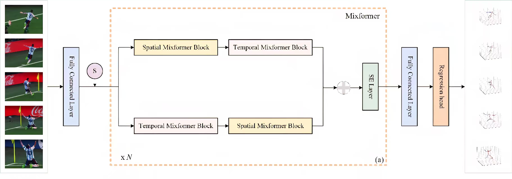

# MixTGFormer(Dual-stream Spatio-Temporal GCN-Transformer Network for 3D Human Pose Estimation)

The official code repository for the MixTGFormer.


## Environment
* Python 3.8.10
* Pytorch 2.0.0
* CUDA 12.2
* For detailed environment configuration, see 'requirements.txt':`pip install -r requirements.txt`.

## Dataset
### Human3.6M
* Preprocessing

  Download the fine-tuned Stacked Hourglass detections of [MotionBERT's](https://github.com/Walter0807/MotionBERT/blob/main/docs/pose3d.md) preprocessed H3.6M data [here](https://onedrive.live.com/?authkey=%21AMG5RlzJp%2D7yTNw&id=A5438CD242871DF0%21206&cid=A5438CD242871DF0&parId=root&parQt=sharedby&o=OneUp) and unzip it to `data/motion3d`.
  
  Slice the motion clips by running the following python code in directory:`data/preprocess`.
* Visualization
  
  Run the following command in the directory:`data/preprocess`.
  ```
  python visualize.py --dataset h36m --sequence-number <AN ARBITRARY NUMBER>
  ```
  This should create a gif file named within directory:`h36m_pose<SEQ_NUMBER>.gif`.
### MPI-INF-3DHP
* Preprocessing
  Please refer to [P-STMO](https://github.com/paTRICK-swk/P-STMO#mpi-inf-3dhp) for dataset setup. After preprocessing, the generated .npz files should be located at `data/motion3d`.
* Visualization
  
  Run it same as the visualization for Human3.6M, but should be set to `--dataset mpi`.

## Training
### Human3.6M
* You can train Human3.6M with the following command:
  ```
  python train.py --config <PATH-TO-CONFIG>
  ```
  where config files are located at `configs/h36m`.You can also use weight and biases for logging the training and validation error by adding at the end. In case of using it, you can set the name using . e.g.:`--use-wandb--wandb-name`.
  ```
  python train.py --config configs/h36m/MotionAGFormer-base.yaml --use-wandb --wandb-name MotionAGFormer-base
  ```
### MPI-INF-3DHP
* You can train MPI-INF-3DHP with the following command:
   ```
  python train_3dhp.py --config <PATH-TO-CONFIG>
   ```
  where config files are located at `configs/mpi`. Like Human3.6M, weight and biases can be used.

## Evaluation
|  Method  | Human 3.6M weights	  | MPI-INF-3DHP weights  |
|  ----  | ----  | ----  |
| MixTGFormer-S  | [download](https://pan.baidu.com/s/1SZkUNa8Vf92eJcdTCq8pjQ) | [download]() |
| MixTGformer  | [download](https://pan.baidu.com/s/1SZkUNa8Vf92eJcdTCq8pjQ) | [download]() |

  After downloading the weight from table above, you can evaluate Human3.6M models by:
   ```
  python train.py --eval-only --checkpoint <CHECKPOINT-DIRECTORY> --checkpoint-file <CHECKPOINT-FILE-NAME> --config <PATH-TO-CONFIG>
   ```
  For example if MixTGFormer of Human 3.6M is downloaded and put in directory, then we can run:checkpoint
   ```
  python train.py --eval-only --checkpoint checkpoint --checkpoint-file mixtgformer-h.pth.tr --config configs/h36m/MixTGFormer.yaml
   ```
  Similarly, MPI-INF-3DHP can be evaluated as follows:
   ```
  python train_3dhp.py --eval-only --checkpoint <CHECKPOINT-DIRECTORY> --checkpoint-file <CHECKPOINT-FILE-NAME> --config <PATH-TO-CONFIG>
   ```

## Acknowledgement
* [MotionBERT](https://github.com/Walter0807/MotionBERT)
* [P-STMO](https://github.com/paTRICK-swk/P-STMO)
* [MotionAGFormer](https://github.com/TaatiTeam/MotionAGFormer)
* Thank you very much for his contribution！
